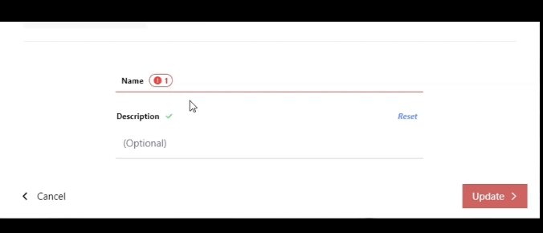

# Backend-driven Frontend Validation
Define your validation rules in one place on the backend and use them throughout your frontend.



## Use Case
With modern data-driven applications, validating data in real-time is a critical step for security and avoiding errors. By utilizing backend-driven validations on the frontend, you eliminate the need define validation rules in two places (DRY), securely validate data against private server-side information, and validate data against entire DB tables if you want - all without adding extra data, code, and peripheral overhead on the frontend.

Let's say for example you want to create a new coupon code for an ecommerce shop. Traditionally, you would usually have some basic form validation on the frontend such as min & max lengths for inputs and which fields are required. You would then probably validate the data further once the form is submitted, validating things such as the uniqueness of the coupon code, making sure the provided discount was within the discount limits set for the current marketing campaign (which is defined in a third-party DB), etc - all things that would either be *extremely challenging* to do on the frontend, if not impossible.

With backend-driven data validation, you can define validation rules in a single place and let the server do all the work, just as God intended.

## Introduction

When I started using Vue, I tried [VeeValidate](https://vee-validate.logaretm.com/v4/), but found the documentation was either lacking or outdated, and was unable to get basic form validation to work (which was probably my own fault, granted - brain doesn't always fire on all cylinders).

I then found [vuelidate](https://github.com/vuelidate/vuelidate) and used that for some time, but after running into a strange bug and digging into the github repo history, I found that the package was [no longer actively developed](https://github.com/vuelidate/vuelidate/issues/1163#issuecomment-1432861559).

At this point, I took a step back and realized that my Vue-specific options were limited. While I'm partial to Vue, I know React-land is bigger than ever, and I figured maybe there's a framework-agnostic tool out there. And there is - [Zod](https://zod.dev/) & [yup](https://github.com/jquense/yup) being the primary libraries I was seeing being used.

However, building out more complicated validation schemas were quickly proving to take up a *lot* of my development time, especially with Zod - which, in my humble opinion, is an example of going overkill with TypeScript (it's supposed to improve DX, but the complexity Zod had made me feel like I was writing an unholy assembly concoction).

I then stumbled on [Laravel Precognition](https://laravel.com/docs/11.x/precognition), a package for harnessing data validation rules on the frontend which are defined on Laravel's backend. It was such a simple solution that I hadn't considered and I was excited to try it out. Unfortunately, for the current project I was working on it wasn't quite a good fit. The project still has some maturing to do, and also requires unique Request classes for each validation scenario, and that was not something I could incorporate into the project without a massive refactoring.

Thus, I worked on this - a simple, single-file Vue composable that does fetches validation results with a given dataset from *any* backend you want. With this convention you can provide "live" validation on your forms without having to rewrite the validation logic in multiple places.

Really, the logic in this composable is simple enough that I'm sure you could easily port it to React as well.

## Quick Start

### Specifications

---

#### Arguments
```ts
type ForMethod = 'GET' | 'PATCH' | 'POST' | 'PUT' | 'DELETE' | 'all'
export default function <T extends object>({
    url: string,
    data: Reactive<T>,
    group?: (keyof T)[][],
    skip?: (keyof T)[],
    immediate_validation?: (keyof T)[],
    for_method?: MaybeRef<ForMethod> | ComputedRef<ForMethod>,
    headers?: Record<string, string>
})
```
 - `url`: The URL which will be polled for validation
 - `data`: A Vue Reactive object containing the fields to be validated
 - `group`: `optional` An array of field groups, with each group being an array of fields
 - `skip`: `optional` An array of fields on which to skip validation
 - `immediate_validation`: `optional` An array of fields for which to do an initial validation, before any data has change using the provided field values
 - `for_method`: `optional` Since all validation server polls are done via `POST` request, you can manually specify which method to include in the `X-Form-Validations-For-Method` HTTP request header. Useful when customizing validation rules depending on the HTTP request type
 - `headers`: `optional` Additional HTTP request headers. Useful if you want to define one Laravel route to handle all validations and specify the specific model/class namespace in a header, for example.

---

#### Properties
```ts
isErrored: Ref<boolean>
```
`true` if *any* field has any errors, `false` if *all* fields have no errors **OR** if the server is actively being polled for validations.

---
```ts
isValid: Ref<boolean>
```
`false` if *any* field has any errors **OR** if the server is actively being polled for validations, `true` if *all* fields have no errors.

---
```ts
isDirty: Ref<boolean>
```
`false` if there are no fields pending server validation, `true` if there are any fields pending server validation

---
```ts
hasErrors: Ref<boolean>
```
`true` if *any* field has any errors, `false` if *all* fields have no errors. **Note** unlike `isErrored` and `isValid`, `hasErrors` ***does not*** change if the server is actively being polled for validations.

---
```ts
errors: Record<keyof T, string[]>
```
The full **errors** object. Each field will be in the object as **key => error[]**:
```ts
import { reactive } from 'vue'
import { useBackendValidation } from 'vue-mccomponents'

// Data to be validated
const data = reactive({
    name: 'Example',    // Rules: required | string | max-characters: 10
    description: null,  // Rules: present | nullable
    count: 3            // Rules: required | min:4
})

// Instantiate
const { errors } = useBackendValidations({
    url: 'https://yourbackend.com/validations/your-model',
    data: data,
})

console.log(errors.value)
/**
 * {
 *  "name":["The name field is too long", "some other error"],
 *  "count": ["The count field must be at least 4"]
 * }
 */

```

---

```ts
dirtyFields: Ref<(keyof T)[]>
```
All fields which are "dirty"; i.e. any field that has changed since it has been validated by the server.

---

```ts
fieldsUnderValidation: Ref<(keyof T)[]>
```
All fields which are currently being validated; differs from `dirtyFields` in that fields are only present here when the server is actively being polled, whereas they are present is `dirtyFields` as soon as data changes.

---

```ts
fieldIsValidating: (keyof T) => boolean
```

Whether a given field is present in the `fieldsUnderValidation` array

---

```ts
isValidating: Ref<boolean>
```
Whether there are *any* fields present in the `fieldsUnderValidation` array

---

```ts
clearErrors: () => void
```
Manually clear all errors.

---

```ts
getErrors: (keyof T) => string[]
```

Returns all errors for a specified field; returns an empty array is there are no errors.

---

```ts
validationState: (keyof T) => ({
    errors: string[],
    isValidating: boolean,
    hasValidation: boolean,
    hasValue: boolean,
    isDirty: boolean
}
```
Returns a validation state object for a given field:
 - `errors`: All errors for the given field; internally it calls the `getErrors()` method for the given field
 - `isValidating`: Whether the field is currently under validation; internally calls the `fieldIsValidating` method for the given field
 - `hasValidation`: `boolean` - Whether or not the field has been validated at least once
 - `hasValue`: `boolean` - `false` if the given field's value is `undefined`, `null`, or `''`; `true` otherwise
 - `isDirty`: `boolean` - Whether the field is present in the `dirtyFields` array

 ---

```ts
validationGroupState: (group: (keyof T)[]) => ({
    dirty: boolean,
    errored: boolean,
    complete: boolean
})
```
Returns a validation state object for a group of fields:
 - `dirty`: `boolean` - Whether *any* fields in the group are dirty
 - `errored`: `boolean` - Whether *any* fields in the group have errors
 - `complete`: `boolean` - Wheter *all* fields in the group are free of errors


### Setting up the backend
I designed this to expect the same response structure that a Laravel validation object returns with the **validate()** method.
So you can still use Laravel or any other framework/library you want to, as long as it returns an object like the following:
```ts
type errors = Record<string, string[]>
```
How this looks in the real world:
```ts
import { reactive } from 'vue'
import { useBackendValidation } from 'vue-mccomponents'

// Data to be validated
const data = reactive({
    name: 'Example',    // Rules: required | string | max-characters: 10
    description: null,  // Rules: present | nullable
    count: 3            // Rules: required | min:4
})

// Instantiate
const { isErrored, validationState, errors } = useBackendValidations({
    url: 'https://yourbackend.com/validations/your-model',
    data: data,
})

// Polls the server when data changes
data.name = 'Example - too long'

// Log response
console.log(errors.value)
/**
 * {
 *  "name":["The name field is too long", "some other error"],
 *  "count": ["The count field must be at least 4"]
 * }
 */
```

## Workflow
Every time any data changes in the provided `data` Reactive object, it will poll the provided URL and store the results. Input changes are denounced by 500ms.

The composable will keep track of each field's state reactively; works well when paired with any of this library's Form Input components, which take a **validation state** object provided by this composable and elegantly handle it for you on the UI.

## Example (Laravel as backend)
As a simple example, let's say you want to setup some form validation for a User model. On the backend, you could setup a validation class like the following:

```php
namespace App\Validations;

use Closure;
use App\Models\User;
use Illuminate\Http\Request;
use Illuminate\Validation\Rules;
use Illuminate\Support\Facades\Validator;

class UserValidation
{

    public static function validations(Request $request)
    {
        $rules = [
            'name' => 'required|string|max:255',
            'email' => 'required|string|lowercase|email|max:255|unique:'.User::class,
            'password' => ['required', 'confirmed', Rules\Password::defaults()],
        ];

        if (httpValidationMethods(['PATCH', 'DELETE']))
        {
            $rules['id'] = ['required', 'numeric', 'exists:users,id'];
        }

        return Validator::make($request->all(), $rules);
    }
}

```

As you can see, I'm using a custom helper method `httpValidationMethods`; this is a custom helper function which utilizes the `X-Form-Validations-For-Method` HTTP request header:
```php
function httpValidationMethods(array $methods): bool
{
    return collect($methods)
    ->map(fn(string $method) => Illuminate\Support\Str::upper($method))
    ->contains(Illuminate\Support\Str::upper(request()->header('X-Form-Validations-For-Method', request()->method())));
}
```
This function expects an array of all HTTP request methods that should match.

Now let's assume you've defined a Laravel Route with a unique URL that passes the request to the UserValidation function and returns the output of the static `validations` method.

We're now ready to setup our frontend:
```vue
<script setup lang="ts">
import { reactive } from 'vue'
import { useBackendValidation } from 'vue-mccomponents'

// Data to be validated
const data = reactive({
    name: 'Example',    // Rules: required | string | max-characters: 10
    description: null,  // Rules: present | nullable
    count: 3            // Rules: required | min:4
})

// Instantiate
const { isErrored, validationState, errors } = useBackendValidations({
    url: 'https://yourbackend.com/validations/your-model',
    data: data,
    for_method: 'PATCH'
})

</script>
<template>
    <div v-if="validationState('name').errors.length > 0">
        <span v-for="error in validationState('name').errors">
            {{ error }}
        </span>
    </div>
    <input v-model="data.name" type="text" />
<template>
```